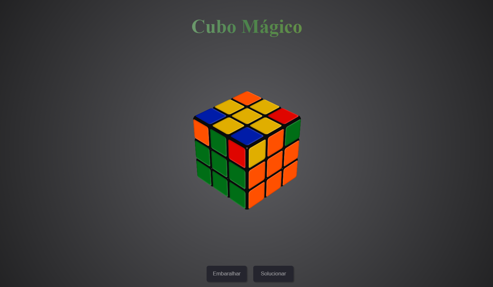

# Cubo de Rubik em JavaScript Puro

## Visualização do Projeto

Você pode visualizar o projeto [clicando aqui](https://cube-de-rubik.vercel.app/).

## Descrição

O Cubo de Rubik é um quebra-cabeça tridimensional muito popular. Este projeto oferece uma implementação em JavaScript puro para simular um Cubo de Rubik e inclui um solucionador que utiliza o Método de Fridrich, um método avançado de resolução do cubo.

## Funcionalidades

- Simulação interativa de um Cubo de Rubik 3x3.
- Movimentos personalizados do cubo.
- Solucionador automático que utiliza o [Método de Fridrich](https://cubesolve.com/como-resolver-o-cubo-magico-pt/amp/).
- Visualização dos passos para a resolução do cubo.

## Pré-requisitos

- Navegador da web (Google Chrome, Mozilla Firefox, etc.).

## Como Usar

Siga estas etapas simples para começar a usar o projeto:

1. Clone ou faça o download deste repositório para o seu computador.

2. Abra o arquivo `index.html` em seu navegador da web.

3. Você será imediatamente apresentado à simulação interativa do Cubo de Rubik.

### Resolvendo o Cubo

Existem duas maneiras de resolver o Cubo de Rubik:

1. **Resolução Automática:**
   - Clique no botão "Resolver" na interface para ativar o solucionador automático, que fará todo o trabalho por você.

2. **Resolução Manual:**
   - Se você preferir uma abordagem mais prática, siga as instruções do [Método de Fridrich](https://cubesolve.com/como-resolver-o-cubo-magico-pt/amp/) para aprender a resolver o cubo manualmente, desafiando suas habilidades e destreza.

Escolha o método que mais lhe convier e aproveite a experiência de resolver o Cubo de Rubik!

## Contribuições

Se desejar contribuir para este projeto, fique à vontade para criar pull requests. Sua contribuição é bem-vinda!

## Autor

<a href="https://github.com/valdir-alves3000/">
 
  
 <b>Valdir Alves </b>🚀</a>

Feito com ❤️ por Valdir Alves. Entre em contato!

